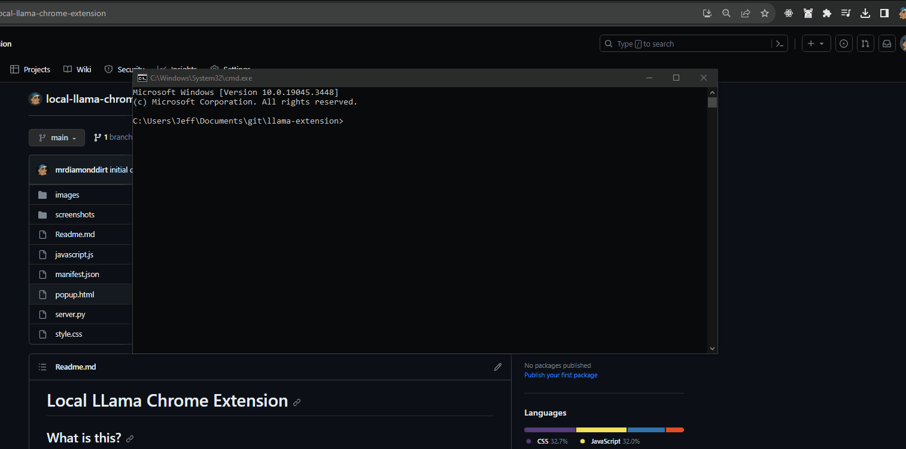

# Local LLama Chrome Extension
## What is this?

This is a chrome extension and flask server that allows you to query the llama-cpp-python models while in the browser. It uses a local server to handle the queries and display the results in a popup.

## Why?

To learn a little bit about chrome extensions and flask. And make a tool that i can use to query the models while using the browser.

## How does it work?

The extension uses the chrome api to get the selected text and send it to the server. The server then queries the model and returns the results to the extension. The extension then displays the results in a popup. The conversations are stored in local storage.
and can be cleared with the clear button in the popup.

## Showcase

## Prerequisites

llama-cpp-python must be installed and some models must be downloaded. See [llama-cpp-python](https://github.com/abetlen/llama-cpp-python) for more information.
Models available for download from huggingface:
- [TheBlokeAI](
https://huggingface.co/TheBloke/)
i'v been using:
- [TheBlokeAI/Llama-2-7B](https://huggingface.co/TheBloke/Llama-2-7b-Chat-GGUF)
for my testing but most of the gguf models should work.
obviously the bigger the model the slower the query. and the more ram it will use.

## How to use it?

### easy mode (download from chrome store)

1. Download the extension from the chrome store
2. Pip install the server with `pip install local-llama`
3. Start the server with `local-llama`
4. Go to any page and click on the extension icon
5. query the model and press enter
6. The results will be displayed in the popup

### pro mode (download from github)

1. Clone this repo
2. Open Chrome and go to `chrome://extensions/`
3. Enable developer mode
4. Click on `Load unpacked` and select the folder where you cloned this repo
5. Go to any page and click on the extension icon
6. build the package with `python setup.py sdist bdist_wheel`
7. Install the package with `pip install .`
8. Start the server with `local-llama`
9. If this is the first time you are using the extension you will be prompted to enter the path for your default model
10. Type in the query and press enter
11. The results will be displayed in the popup

## TODO

- [x] add a server to handle the queries
- [x] add a popup to display the results
- [x] store and retrieve conversations
- [x] clear saved conversations
- [x] add a settings page
- [x] add a way to change the model easily
- [x] turn the server.py into a proper python package, to make it easier to install and use if downloaded from the chrome store
- [x] add a way to change the server address
- [ ] hadle when an html is added to the codeblock
- [ ] add a way to download models from huggingface
- [ ] add a way to start the server from the extension